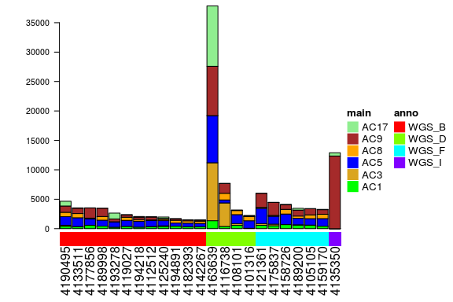
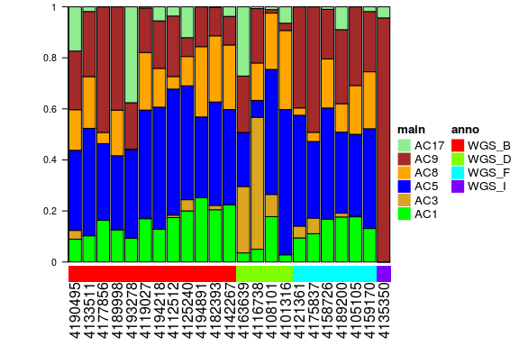
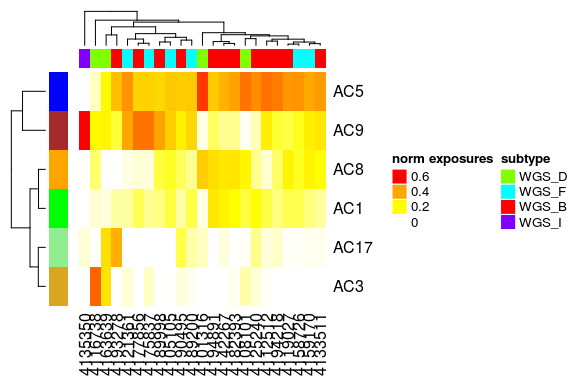
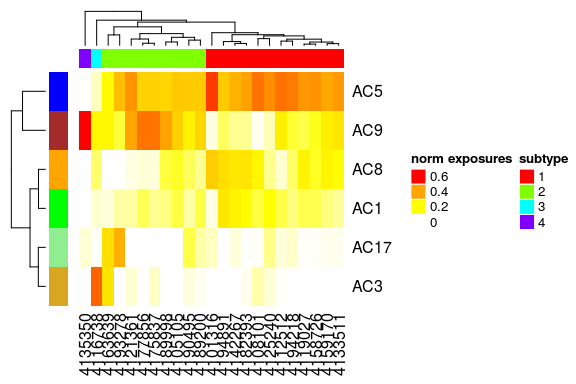
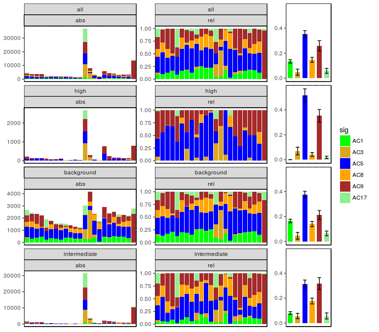

# YAPSA
Daniel Huebschmann  
26/08/2015  


# Citation

The package is currently being submitted to 
[Bioconductor](https://www.bioconductor.org/). Please use it once it is 
accepted there and a suitable citation is provided.


# General design

## Introduction

The concept of mutational signatures was introduced in a series of papers by 
Ludmil Alexandrov, Serena Nik-Zainal, Michael Stratton and others (for precise 
citations please refer to the vignette of the package). The general 
approach is as follows:

1. The SNVs are categorized by their nucleotide exchange. In total there are 
`4 x 3 = 12` different nucleotide exchanges, but if summing over reverse 
complements only `12 / 2 = 6` different categories are left. For every SNV 
detected, the motif context around the position of the SNV is extracted. This 
may be a trinucleotide context if taking one base upstream and one base 
downstream of the position of the SNV, but larger motifs may be taken as well 
(e.g. pentamers). Taking into account the motif context increases combinatorial 
complexity: in the case of the trinucleotide context, there are 
`4 x 6 x 4 = 96` different variant categories. These categories are 
called **features** in the following text. The number of features will be 
called `n`.
2. A cohort consists of different samples with the number of samples denoted by 
`m`. For each sample we can count the occurences of each feature, yielding an 
`n`-dimensional vector (`n` being the number of features) per sample. For a 
cohort, we thus get an `n x m` -dimensional matrix, called the 
**mutational catalogue** `V`. It can be understood as a summary indicating 
which sample has how many variants of which category, but omitting the 
information of the genomic coordinates of the variants.
3. The mutational catalogue `V` is quite big and still carries a lot of 
complexity. For many analyses a  reduction of complexity is desirable. One way 
to achieve such a complexity reduction is a matrix decomposition: we would like 
to find two smaller matrices `W` and `H` which if multiplied would span a high 
fraction of the complexity of the big matrix `V` (the mutational catalogue). 
Remember that `V` is an `n x m` -dimensional matrix, `n` being the number 
of features and `m` being the number of samples. `W` in this setting is an 
`n x l` -dimensional matrix and `H` is an `l x m` -dimensional 
matrix. The columns of 
`W` are called the **mutational signatures** and the columns of `H` are called 
**exposures**. `l` denotes the number of mutational signatures. Hence the 
signatures are `n`-dimensional vectors (with `n` being the number of features), 
while the exposures are `l`-dimensional vectors (`l` being the number of 
signatures). Note that as we are dealing with count data, we would like to have 
only positive entries in `W` and `H`. A mathematical method which is able to do 
such a decomposition is the **NMF** (**nonnegative matrix factorization**). It 
basically solves the problem as illustrated in the following figure:


Of course the whole concept only leads to a reduction in complexity if `l < n`, 
i.e. if the number of signatures is smaller than the number of features, as 
indicated in the above figure. Note that the NMF itself solves the above 
problem for a given number of signatures `l`. Addinional criteria exist to 
evaluate the true number of signatures.

## The YAPSA package

In a context where mutational signatures `W` are already known (because they 
were decribed and published or they are available in a 
database as under <http://cancer.sanger.ac.uk/cosmic/signatures>), we might 
want to just find the exposures `H` for these known signatures in the 
mutational catalogue `V` of a given cohort. 

The **YAPSA**-package (Yet Another Package for Signature Analysis) presented 
here provides the function `LCD` (**l**inear **c**ombination **d**ecomposition) 
to perform this task. The advantage of this method is that there are **no 
constraints on the cohort size**, so `LCD` can be run for as little as one 
sample and thus be used e.g. for signature analysis in personalized oncology. 
In contrast to NMF, `LCD` is very fast and requires very little computational 
resources. The YAPSA package provides additional functions for signature 
analysis, e.g. for stratifying the mutational catalogue to determine signature 
exposures in different strata, part of which is discussed in the vignette of 
the package.


# Install

As long as `YAPSA` is not yet accepted on 
[Bioconductor](https://www.bioconductor.org/) it may be downloaded and installed 
from [github](https://github.com/):


```r
library(devtools)
install_github("huebschm/YAPSA")
```

Of course, `devtools` has to be installed:


```r
install.packages("devtools")
```

`YAPSA` uses the newest versions of the pacakges `circlize` and `ComplexHeatmap` 
by Zuguang Gu. These are not in the release branch of Bioconductor, therefore 
they may need to be installed from [github](https://github.com/) as well:


```r
install_github("jokergoo/circlize")
install_github("jokergoo/ComplexHeatmap")
```

If you ran into dependency conflicts before, try rerunning 
`install_github("huebschm/YAPSA")` now.


# Usage

## Example: a cohort of B-cell lymphomas


```r
library(YAPSA)
library(knitr)
opts_chunk$set(echo=TRUE)
opts_chunk$set(fig.show='asis')
```

### Loading example data

Load data in a vcf-like format:


```r
data("lymphoma_Nature2013_raw")
```

Adapt the data structure:


```r
names(lymphoma_Nature2013_raw_df) <- c("PID","TYPE","CHROM","START",
                                       "STOP","REF","ALT","FLAG")
lymphoma_Nature2013_df <- subset(lymphoma_Nature2013_raw_df,TYPE=="subs",
                                 select=c(CHROM,START,REF,ALT,PID))
names(lymphoma_Nature2013_df)[2] <- "POS"
head(lymphoma_Nature2013_df)
```

```
##   CHROM       POS REF ALT      PID
## 1     1 183502381   G   A 07-35482
## 2    18  60985506   T   A 07-35482
## 3    18  60985748   G   T 07-35482
## 4    18  60985799   T   C 07-35482
## 5     2 242077457   A   G 07-35482
## 6     6  13470412   C   T 07-35482
```

Note that there are 48 different samples:


```r
unique(lymphoma_Nature2013_df$PID)
```

```
##  [1] 07-35482       1060           1061           1065          
##  [5] 1093           1096           1102           4101316       
##  [9] 4105105        4108101        4112512        4116738       
## [13] 4119027        4121361        4125240        4133511       
## [17] 4135350        4142267        4158726        4159170       
## [21] 4163639        4175837        4177856        4182393       
## [25] 4189200        4189998        4190495        4193278       
## [29] 4194218        4194891        515            DLBCL-PatientA
## [33] DLBCL-PatientB DLBCL-PatientC DLBCL-PatientD DLBCL-PatientE
## [37] DLBCL-PatientF DLBCL-PatientG DLBCL-PatientH DLBCL-PatientI
## [41] DLBCL-PatientJ DLBCL-PatientK DLBCL-PatientL DLBCL-PatientM
## [45] EB2            FL009          FL-PatientA    G1            
## 48 Levels: 07-35482 1060 1061 1065 1093 1096 1102 4101316 ... G1
```

For convenience later on, we annotate subgroup information to every variant 
(indirectly through the sample it occurs in). For reasons of simplicity, we 
also restrict the analysis to the Whole Genome Sequencing (WGS) datasets:


```r
library(YAPSA)
lymphoma_Nature2013_df$SUBGROUP <- "unknown"
DLBCL_ind <- grep("^DLBCL.*",lymphoma_Nature2013_df$PID)
lymphoma_Nature2013_df$SUBGROUP[DLBCL_ind] <- "DLBCL_other"
MMML_ind <- grep("^41[0-9]+$",lymphoma_Nature2013_df$PID)
lymphoma_Nature2013_df <- lymphoma_Nature2013_df[MMML_ind,]
data(lymphoma_PID)
for(my_PID in rownames(lymphoma_PID_df)) {
  PID_ind <- which(as.character(lymphoma_Nature2013_df$PID)==my_PID)
  lymphoma_Nature2013_df$SUBGROUP[PID_ind] <-
    lymphoma_PID_df$subgroup[which(rownames(lymphoma_PID_df)==my_PID)]
}
lymphoma_Nature2013_df$SUBGROUP <- factor(lymphoma_Nature2013_df$SUBGROUP)
unique(lymphoma_Nature2013_df$SUBGROUP)
```

```
## [1] WGS_D WGS_F WGS_B WGS_I
## Levels: WGS_B WGS_D WGS_F WGS_I
```

As stated [above](#LCD), one of the functions in the YAPSA package (`LCD`) is 
designed to do mutational signatures analysis with known signatures. There are 
(at least) two possible sources for signature data: i) the ones published 
initially by Alexandrov, and ii) an updated and curated 
current set of mutational signatures is maintained by Ludmil Alexandrov at <http://cancer.sanger.ac.uk/cosmic/signatures>.


```r
data(sigs)
```

Now we can start using main functions of the YAPSA package: `LCD` and 
`LCD_complex_cutoff`.

### Building a mutational catalogue

This section uses functions which are to a large extent wrappers for functions 
in the package `SomaticSignatures` by Julian Gehring.


```r
library(BSgenome.Hsapiens.UCSC.hg19)
lymphoma_Nature2013_df <- translate_to_hg19(lymphoma_Nature2013_df,"CHROM")
lymphoma_Nature2013_df$change <- 
  attribute_nucleotide_exchanges(lymphoma_Nature2013_df)
```

```
## attribute_nucleotide_exchanges::in_REF.field found.  Retrieving REF information.
## attribute_nucleotide_exchanges::in_ALT.field found.  Retrieving ALT information.
```

```r
lymphoma_Nature2013_df <- 
  lymphoma_Nature2013_df[order(lymphoma_Nature2013_df$PID,
                               lymphoma_Nature2013_df$CHROM,
                               lymphoma_Nature2013_df$POS),]
lymphoma_Nature2013_df <- annotate_intermut_dist_cohort(lymphoma_Nature2013_df,
                                                        in_PID.field="PID")
```


```r
word_length <- 3

lymphomaNature2013_mutCat_list <- 
  create_mutation_catalogue_from_df(
    lymphoma_Nature2013_df,
    this_seqnames.field = "CHROM", this_start.field = "POS",
    this_end.field = "POS", this_PID.field = "PID",
    this_subgroup.field = "SUBGROUP",
    this_refGenome = BSgenome.Hsapiens.UCSC.hg19,
    this_wordLength = word_length)
```

The function `create_mutation_catalogue_from_df` returns a list object with 
several entries. We will use the one called `matrix`.


```r
names(lymphomaNature2013_mutCat_list)
```

```
## [1] "matrix" "frame"
```

```r
lymphomaNature2013_mutCat_df <- as.data.frame(
  lymphomaNature2013_mutCat_list$matrix)
kable(lymphomaNature2013_mutCat_df[c(1:9),c(5:10)])
```

           4116738   4119027   4121361   4125240   4133511   4135350
--------  --------  --------  --------  --------  --------  --------
C>A ACA        127        31        72        34        49        75
C>A ACC        104        36        39        19        36        80
C>A ACG         13         2         2         1         6         8
C>A ACT        102        33        48        22        47        56
C>A CCA        139        43        47        29        51        70
C>A CCC         66        34        35         7        25        42
C>A CCG          9         7         6         3         7        11
C>A CCT        167        47        50        32        58        84
C>A GCA         90        47        66        29        45        66

### LCD analysis with signature-specific cutoffs

When using `LCD_complex_cutoff`, we have to supply a vector of cutoffs with as 
many entries as there are signatures. In the analysis carried out above, these 
were all equal, but this is not a necessary condition. Indeed it may make sense 
to provide different cutoffs for different signatures.


```r
specific_cutoff_vector <- general_cutoff_vector
specific_cutoff_vector[c(1,5)] <- 0
specific_cutoff_vector
```

```
##  [1] 0.00 0.06 0.06 0.06 0.00 0.06 0.06 0.06 0.06 0.06 0.06 0.06 0.06 0.06
## [15] 0.06 0.06 0.06 0.06 0.06 0.06 0.06 0.06 0.06 0.06 0.06 0.06 0.06 0.06
## [29] 0.06 0.06
```

In this example, the cutoff for signatures AC1 and AC5 is thus set to 0, whereas 
the cutoffs for all other signatures remains at 0.06. Running the function
`LCD_complex_cutoff` is completely analogous:


```r
CosmicValid_cutoffSpec_LCDlist <- LCD_complex_cutoff(
  in_mutation_catalogue_df = lymphomaNature2013_mutCat_df,
  in_signatures_df = current_sig_df,
  in_cutoff_vector = specific_cutoff_vector,
  in_sig_ind_df = current_sigInd_df)
```

Plotting absolute exposures for visualization:


```r
exposures_barplot(
  in_exposures_df = CosmicValid_cutoffSpec_LCDlist$exposures,
  in_signatures_ind_df = CosmicValid_cutoffSpec_LCDlist$out_sig_ind_df,
  in_subgroups_df = COSMIC_subgroups_df)
```



And relative exposures:


```r
exposures_barplot(
  in_exposures_df = CosmicValid_cutoffSpec_LCDlist$norm_exposures,
  in_signatures_ind_df = CosmicValid_cutoffSpec_LCDlist$out_sig_ind_df,
  in_subgroups_df = COSMIC_subgroups_df)
```



Note that the signatures extracted with the signature-specific cutoffs are the 
same in the example displayed here. Depending on the analyzed cohort and the 
choice of cutoffs, the extracted signatures may vary considerably.


## Cluster samples based on their signature exposures

To identify groups of samples which were exposed to similar mutational 
processes, the exposure vectors of the samples can be compared. The YAPSA 
package provides a custom function for this task: `complex_heatmap_exposures`, 
which uses the package *[ComplexHeatmap](http://bioconductor.org/packages/ComplexHeatmap)* by Zuguang Gu 
[@ComplexHeatmap2015]. It produces output as follows:


```r
complex_heatmap_exposures(CosmicValid_cutoffGen_LCDlist$norm_exposures,
                          COSMIC_subgroups_df,
                          CosmicValid_cutoffGen_LCDlist$out_sig_ind_df,
                          in_data_type="norm exposures",
                          in_subgroup_colour_column="col",
                          in_method="manhattan",
                          in_subgroup_column="subgroup")
```



If you are interested only in the clustering and not in the heatmap 
information, you could also use `hclust_exposures`:


```r
hclust_list <- 
  hclust_exposures(CosmicValid_cutoffGen_LCDlist$norm_exposures,
                   COSMIC_subgroups_df,
                   in_method="manhattan",
                   in_subgroup_column="subgroup")
```

The dendrogram produced by either the function `complex_heatmap_exposures` or 
the function `hclust_exposures` can be cut to yield signature exposure specific 
subgroups of the PIDs.


```r
cluster_vector <- cutree(hclust_list$hclust,k=4)
COSMIC_subgroups_df$cluster <- cluster_vector
subgroup_colour_vector <- rainbow(length(unique(COSMIC_subgroups_df$cluster)))
COSMIC_subgroups_df$cluster_col <- 
  subgroup_colour_vector[factor(COSMIC_subgroups_df$cluster)]
complex_heatmap_exposures(CosmicValid_cutoffGen_LCDlist$norm_exposures,
                          COSMIC_subgroups_df,
                          CosmicValid_cutoffGen_LCDlist$out_sig_ind_df,
                          in_data_type="norm exposures",
                          in_subgroup_colour_column="cluster_col",
                          in_method="manhattan",
                          in_subgroup_column="cluster")
```




## Performing a stratification based on mutation density

We will now use the intermutational distances computed above. We set cutoffs 
for the intermutational distance at 1000 and 100000 bp, leading to three 
strata. We annotate to every variant in which stratum it falls.


```r
lymphoma_Nature2013_df$density_cat <- cut(lymphoma_Nature2013_df$dist,
                                          c(0,1001,100001,Inf),
                                          right=FALSE,
                                          labels=c("high","intermediate","background"))
```

The following table shows the distribution of variants over strata:


```r
temp_df <- data.frame(table(lymphoma_Nature2013_df$density_cat))
names(temp_df) <- c("Stratum","Cohort-wide counts")
kable(temp_df, caption=paste0("Strata for the SMC of mutation density"))
```


Table: Strata for the SMC of mutation density

Stratum         Cohort-wide counts
-------------  -------------------
high                          6818
intermediate                 62131
background                   50675

We now have everything at hand to carry out a stratified signature analysis:


```r
strata_order_ind <- c(1,3,2)
mut_density_list <- run_SMC(lymphoma_Nature2013_df,
                            CosmicValid_cutoffGen_LCDlist$signatures,
                            CosmicValid_cutoffGen_LCDlist$out_sig_ind_df,
                            COSMIC_subgroups_df,
                            column_name="density_cat",
                            refGenome=BSgenome.Hsapiens.UCSC.hg19,
                            cohort_method_flag="norm_PIDs",
                            in_strata_order_ind=strata_order_ind)
```



This produces a multi-panel figure with 
4 rows of plots. The 
first row visualizes the signature distribution over the whole cohort without 
stratification, followed by one row of plots per stratum. Hence in our example 
we have four rows of graphs with three (exclusive) strata as input. Each row 
consists of three plots. The left plots show absolute exposures in the 
respective stratum as stacked barplots on a per sample basis. The middle plots 
show relative exposures in the respective stratum on a per sample basis as 
stacked barplots. The right plots shows cohort-wide averages of the relative 
exposures in the respective stratum. The error bars indicate the standard error 
of the mean (SEM).

To test for statistical significance of potential differences in the signature 
exposures (i.e. signature enrichment and depletion patterns) between the 
different strata, we can use the Kruskal-Wallis test, as the data is grouped 
into (potentially more than two) categories and might not follow a normal 
distribution. As we are testing the different signatures on the same 
stratification, we have to correct for multiple testing. In order to control 
the false discovery rate (FDR), the Benjamini-Hochberg correction is 
appropriate.


```r
stat_mut_density_list <- stat_test_SMC(mut_density_list,in_flag="norm")
kable(stat_mut_density_list$kruskal_df,
      caption=paste0("Results of Kruskal tests for cohort-wide exposures over",
                     " strata per signature without and with correction for ",
                     "multiple testing."))
```


Table: Results of Kruskal tests for cohort-wide exposures over strata per signature without and with correction for multiple testing.

        Kruskal_statistic   df   Kruskal_p_val   Kruskal_p_val_BH
-----  ------------------  ---  --------------  -----------------
AC1            49.9620038    2       0.0000000          0.0000000
AC3             0.6985189    2       0.7052101          0.7052101
AC5            10.2070496    2       0.0060753          0.0091129
AC8            19.4325695    2       0.0000603          0.0001809
AC9             5.8243570    2       0.0543572          0.0652286
AC17           10.4314799    2       0.0054304          0.0091129

In the following paragraph we perform post-hoc tests for those signatures where 
the Kruskal-Wallis test, as evaluated above, has given a significant result.
\newpage


```r
significance_level <- 0.05
for(i in seq_len(dim(stat_mut_density_list$kruskal_df)[1])){
  if(stat_mut_density_list$kruskal_df$Kruskal_p_val_BH[i]<significance_level){
    print(paste0("Signature: ",rownames(stat_mut_density_list$kruskal_df)[i]))
    print(stat_mut_density_list$kruskal_posthoc_list[[i]])
  }
}
```

```
## [1] "Signature: AC1"
## 
## 	Pairwise comparisons using Tukey and Kramer (Nemenyi) test	
##                    with Tukey-Dist approximation for independent samples 
## 
## data:  sig_exposures_vector and sig_strata_vector 
## 
##              background high   
## high         2.3e-11    -      
## intermediate 0.028      5.3e-05
## 
## P value adjustment method: none 
## [1] "Signature: AC5"
## 
## 	Pairwise comparisons using Tukey and Kramer (Nemenyi) test	
##                    with Tukey-Dist approximation for independent samples 
## 
## data:  sig_exposures_vector and sig_strata_vector 
## 
##              background high  
## high         0.1706     -     
## intermediate 0.3466     0.0041
## 
## P value adjustment method: none 
## [1] "Signature: AC8"
## 
## 	Pairwise comparisons using Tukey and Kramer (Nemenyi) test	
##                    with Tukey-Dist approximation for independent samples 
## 
## data:  sig_exposures_vector and sig_strata_vector 
## 
##              background high   
## high         0.0051     -      
## intermediate 0.5240     7.7e-05
## 
## P value adjustment method: none 
## [1] "Signature: AC17"
## 
## 	Pairwise comparisons using Tukey and Kramer (Nemenyi) test	
##                    with Tukey-Dist approximation for independent samples 
## 
## data:  sig_exposures_vector and sig_strata_vector 
## 
##              background high  
## high         0.0078     -     
## intermediate 0.3201     0.2674
## 
## P value adjustment method: none
```


From this analysis, we can see that a distinct signature enrichment and 
depletion pattern emerges:

1. Stratum of high mutation density: Enrichment of signatures AC5 (significant) 
and AC9, depletion of signatures AC1 (significant), AC2, AC8 (significant) and 
AC17
2. Background: signature distribution very similar to the one of the complete 
mutational catalogue (first row)
3. Stratum of intermediate mutation density: intermediate signature enrichment 
and depletion pattern between the strata of high mutation density and 
background. 


# Features of the package not covered in this vignette

* Normalization of a mutational catalogue if the sequencing was not performed 
on the whole genome level, but instead a target capture approach like Whole 
Exome Sequencing (WES) or panel sequencing has been used. If the target capture 
regions are supplied as a .bed file, the trinucleotide content (or more general 
the motif content) of the target capture regions is extracted and the 
mutational catalogue normalized to this different background motif distribution 
to make the signature analysis comparable. For this purpose, a perl script 
called `kmer_frenquencies.pl` and a wrapper function `run_kmer_frequency_pl` in 
R are available.
* An external perl script `annotate_vcf` and a corresponding wrapper function 
in R are available to annotate whatever feature is available to the vcf-like 
file from which the mutational catalogue is then created. This additionally 
annotated information may then be used for stratification.
* Automatic report generation for either whole cohorts or individual samples.


# References
